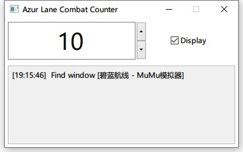

# Azur Lane Combat Counter

Automatic combat recording for Azur Lane.



Currently only MuMu Emulator is supported for recognition. To support another emulator, you can inherit the `GameWindow` class and replace the constructor in `Worker.__init__()`.

```python
class MyGameWindow(GameWindow):
    def _setup_window(self):
        hwnd, title = get_window('My Emulator')

        # for example the game screen is represented by a child window named "canvas"
        self.canvas_hwnd, _ = get_window('canvas', hwnd)
        self.canvas_hdc = win32gui.GetDC(self.canvas_hwnd)

# in Worker.__init__()
self.game_window = MyGameWindow(logger)
```

Recognition may not succeed when the emulator window is too small.

Quitting the combat before it ends does not prevent the counter from increasing.

**PVP combats are also counted.**
